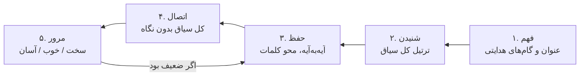
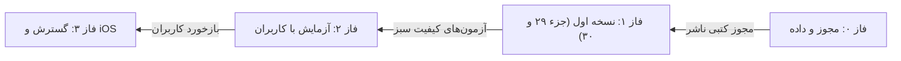

# سند محصول: اپلیکیشن حفظ تدبری قرآن

> نسخه ۱ · ۱۶ مهر ۱۴۰۵ (۸ اکتبر ۲۰۲۶) · نسخه زنده و قابل ویرایش این سند در Claude Docs نگهداری می‌شود.

## خلاصه و چشم‌انداز

یک اپلیکیشن موبایل فارسی برای حفظ قرآن که واحد حفظ در آن «سیاق» است، نه صفحه یا آیه. کاربر هر سیاق را اول می‌فهمد، بعد می‌شنود، بعد حفظ می‌کند و با مرور فاصله‌دار تثبیت می‌کند.

تقسیم‌بندی سیاق‌ها بر اساس مجموعه «تدبر در قرآن کریم» استاد علی صبوحی طسوجی است و استفاده از آن منوط به مجوز ناشر است.

**چشم‌انداز:** حافظی که هر آیه را در جای خودش در منطق سوره می‌شناسد، نه فقط از بر کردن الفاظ.

**نسخه اول (MVP):** سوره‌های جزء ۲۹ و ۳۰، با قرائت ترتیل آیه‌به‌آیه، داشبورد حفظ و مرور فاصله‌دار، کاملاً آفلاین.

## مسئله و کاربران هدف

روش‌های رایج حفظ، آیات را جدا از معنا و جدا از جایگاهشان در سوره حفظ می‌کنند. نتیجه، فراموشی سریع، جابه‌جا خواندن آیات مشابه و حفظی است که به فهم وصل نیست.

| کاربر | نیاز اصلی | معیار موفقیت |
| --- | --- | --- |
| بزرگسال شاغل علاقه‌مند به تدبر | حفظ کم ولی عمیق، روزی ۱۵ تا ۲۰ دقیقه | هر هفته حداقل یک سیاق تثبیت‌شده |
| شاگرد دوره‌های تدبر | همراهی کتاب استاد صبوحی هنگام حفظ | دیدن گام‌های هدایتی کنار متن |
| حافظ قبلی | مرور منظم و رفع اشتباه آیات مشابه | کاهش خطا در آزمون مرور |

## مرور بازار و رقبا

هیچ اپ موجودی حفظ را بر اساس سیاق سازمان نداده است؛ این جایگاه خالی، مزیت اصلی محصول است.

| اپ | نقطه قوت | آنچه ندارد |
| --- | --- | --- |
| [قرآن هادی](https://apps.apple.com/us/app/1099558951) | ترتیل آیه‌به‌آیه، تفسیر المیزان و نمونه، یادداشت، برنامه ختم، رابط تمیز | سیستم حفظ و تقسیم‌بندی معنایی |
| [تصویر نور](https://cafebazaar.ir/app/ir.hefzequran.tasvirenoor) | حفظ با حافظه تصویری، ۱۲ نوع آزمون | پیوند حفظ با فهم و ساختار سوره |
| [حفظ کن](https://cafebazaar.ir/app/ir.quran2) | لیست حفظ آیه‌ای و سوره‌ای، آمار پیشرفت | مرور فاصله‌دار و سیاق |
| [قلم هوشمند قرآنی](https://cafebazaar.ir/app/com.MOHSEN007485.smartpenquran) | ۳۶ قاری، پرسش برای حفظ | واحد حفظ معنایی |

از قرآن هادی کیفیت رابط کاربری و پخش صوت را الگو می‌گیریم، نه محتوا یا کد آن را.

## روش تدبری استاد صبوحی و مدل داده

در این روش هر سوره به چند سیاق (مجموعه‌ای از آیات با اتصال مفهومی) تقسیم می‌شود؛ هر سیاق عنوان و گام‌های هدایتی دارد و ارتباط سیاق‌ها «جهت هدایتی سوره» را می‌سازد ([طاقچه](https://taaghche.com/book/110065)). همین ساختار، ساختار داده اپ است.

| موجودیت | فیلدها | منبع |
| --- | --- | --- |
| سوره | شماره، نام، مکی/مدنی، تعداد آیات، جهت هدایتی | Tanzil + کتاب |
| فصل (اختیاری) | شماره، عنوان، سیاق شروع و پایان | کتاب، باید تأیید شود |
| سیاق | شماره، آیه شروع، آیه پایان، عنوان، گام‌های هدایتی | کتاب، با مجوز |
| گام هدایتی | ترتیب، متن کوتاه، بازه آیات | کتاب، با مجوز |
| آیه | سوره، شماره، متن عثمانی، ترجمه، زمان‌بندی صوت | Tanzil + ترجمه + صوت |
| وضعیت حفظ کاربر | سیاق، مرحله، قوت حافظه، موعد مرور بعدی، تاریخچه آزمون | دستگاه کاربر |

**قاعده داده:** هر آیه دقیقاً در یک سیاق است؛ بازه‌ها پیوسته‌اند و همپوشانی ندارند.

**سؤال باز:** آیا در کتاب سطحی به نام «فصل» بالاتر از سیاق وجود دارد یا فصل همان بخش‌بندی درون سیاق است؟

## قابلیت‌ها و چرخه حفظ

هسته محصول یک چرخه پنج‌مرحله‌ای است که روی هر سیاق اجرا می‌شود؛ فهم همیشه قبل از حفظ می‌آید.

**قابلیت‌های نسخه اول:**

- مصحف کامل با ترتیل آیه‌به‌آیه، تنظیم تکرار و سرعت
- نمایش مرز سیاق‌ها و عنوان هر سیاق در حاشیه مصحف
- جلسه حفظ پنج‌مرحله‌ای برای هر سیاق
- مرور فاصله‌دار با ارزیابی سه‌گانه
- داشبورد پیشرفت و یادآور روزانه
- یادداشت تدبری کاربر روی هر سیاق

## داشبورد و صفحات اصلی

| صفحه | محتوا | اقدام اصلی |
| --- | --- | --- |
| داشبورد | سیاق امروز، صف مرور امروز، روزهای پیوسته، نقشه کل سوره‌ها | «ادامه حفظ» |
| نقشه سوره | نوار سیاق‌ها با رنگ وضعیت، جهت هدایتی سوره | انتخاب یک سیاق |
| جلسه حفظ | ۵ مرحله: فهم، شنیدن، حفظ آیه‌به‌آیه، اتصال، ثبت | «مرحله بعد» |
| مرور | سیاق‌های سررسیده، آزمون یادآوری، ارزیابی «سخت / خوب / آسان» | ثبت نتیجه |
| مصحف | خواندن آزاد با ترتیل، نمایش مرز سیاق‌ها در حاشیه | پخش صوت |

**رنگ وضعیت سیاق:** خاکستری = شروع‌نشده، آبی = در حال حفظ، سبز = تثبیت‌شده، نارنجی = نیاز به مرور.

## معماری فنی

| لایه | انتخاب | دلیل |
| --- | --- | --- |
| اپ | Flutter (یک کد برای اندروید و iOS) | پشتیبانی خوب از راست‌به‌چپ و فونت عربی |
| پایگاه داده محلی | SQLite (بسته drift) | کار کاملاً آفلاین |
| داده قرآن | فایل JSON نسخه‌دار، ساخته‌شده از Tanzil | متن بدون تغییر، قابل بررسی خودکار |
| داده سیاق | فایل JSON جدا، نسخه‌دار، پس از مجوز | به‌روزرسانی مستقل از متن |
| صوت | آیه‌به‌آیه، دانلود هر سوره هنگام نیاز | حجم کم نصب اولیه |
| مرور فاصله‌دار | الگوریتم FSRS روی هر سیاق | زمان‌بندی دقیق‌تر از جعبه لایتنر |
| انتشار | کافه‌بازار و مایکت، بعداً App Store | دسترسی کاربر ایرانی |

## منابع داده و مجوزها

| داده | منبع | شرط استفاده | وضعیت |
| --- | --- | --- | --- |
| متن قرآن (عثمانی) | [Tanzil](https://tanzil.net) | بدون تغییر، ذکر منبع و لینک به tanzil.net | آماده |
| تقسیم سیاق و گام‌های هدایتی | انتشارات تدبر در کلام وحی و سیره ائمه اطهار | مجوز کتبی ناشر | باید درخواست شود |
| ترجمه فارسی | مثلاً انصاریان یا فولادوند | مجوز مترجم یا ناشر | باید انتخاب شود |
| صوت ترتیل | مثلاً پرهیزگار، منشاوی | اجازه صاحب اثر | باید انتخاب شود |
| فونت قرآن | مثلاً فونت‌های مجمع ملک فهد | شرایط مجوز فونت | باید بررسی شود |

تا گرفتن مجوز، این مخزن عمومی فقط داده‌های نمونه آزمایشی دارد، نه تقسیم‌بندی کتاب.

## کنترل کیفیت و معیارهای پذیرش

- [ ] متن هر ۶۲۳۶ آیه با فایل مرجع Tanzil نویسه‌به‌نویسه یکسان است
- [ ] هر آیه در دقیقاً یک سیاق قرار دارد؛ بازه‌ها بدون فاصله و همپوشانی‌اند
- [ ] تعداد آیات هر سوره با جدول مرجع ۱۱۴ سوره برابر است
- [ ] صوت هر آیه با آیه درست پخش می‌شود
- [ ] جهت متن، اعداد فارسی و فونت در اندروید ۸ به بعد و iOS ۱۵ به بعد درست است
- [ ] اپ بدون اینترنت باز می‌شود و جلسه حفظ کامل می‌شود
- [ ] زمان‌بندی مرور پس از هر ارزیابی درست محاسبه می‌شود
- [ ] داده سیاق‌ها پیش از انتشار به تأیید یک کارشناس تدبر رسیده است

## نقشه راه و ریسک‌ها

| ریسک | اثر | راه‌حل |
| --- | --- | --- |
| ناشر مجوز ندهد | مزیت اصلی از دست می‌رود | پیشنهاد مشارکت؛ یا ابزار تقسیم‌بندی شخصی به دست کاربر |
| خطای متن قرآن | غیرقابل‌قبول | مقایسه خودکار با Tanzil در هر ساخت |
| ناهماهنگی صوت و آیه | اعتماد کاربر از بین می‌رود | صوت آیه‌به‌آیه، تست نمونه‌ای هر قاری |
| حجم زیاد برنامه | نصب کمتر | دانلود صوت به تفکیک سوره |
